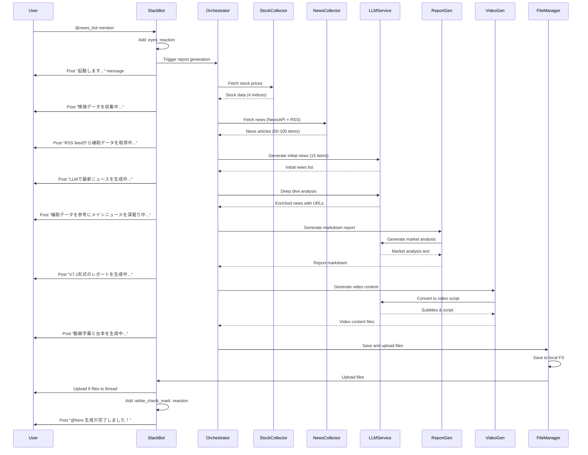

# Design Document

## Overview

V7.2 ニュースレポート自動生成システムは、Slack Bot をトリガーとして、複数のデータソースから金融ニュース情報を収集し、LLM を活用して高品質な日本語レポートと動画用コンテンツを生成するシステムです。

本システムは、以下の主要コンポーネントで構成されます：
- **Slack Bot**: ユーザーインターフェースとトリガー
- **Data Collectors**: 株価データとニュースデータの収集
- **LLM Service**: マルチプロバイダー対応の LLM 統合レイヤー
- **Report Generator**: レポートと動画コンテンツの生成
- **File Manager**: ファイル生成と Slack アップロード

## Architecture

### System Architecture Diagram

```mermaid
graph TB
    User[Slack User] -->|@news_bot mention| SlackBot[Slack Bot Handler]
    SlackBot -->|trigger| Orchestrator[Report Generation Orchestrator]
    
    Orchestrator -->|1. fetch| StockCollector[Stock Data Collector]
    Orchestrator -->|2. fetch| NewsCollector[News Data Collector]
    Orchestrator -->|3. generate| LLMService[LLM Service]
    Orchestrator -->|4. generate| ReportGen[Report Generator]
    Orchestrator -->|5. generate| VideoGen[Video Content Generator]
    Orchestrator -->|6. upload| FileManager[File Manager]
    
    StockCollector -->|yfinance| YFinance[yfinance API]
    NewsCollector -->|HTTP| NewsAPI[NewsAPI.org]
    NewsCollector -->|RSS| InvestingRSS[Investing.com RSS]
    
    LLMService -->|priority 1| Gemini[Google Gemini 3.0]
    LLMService -->|priority 2| GPT[OpenAI GPT-5.1]
    LLMService -->|priority 3| Claude[Anthropic Claude 3.5]
    
    FileManager -->|upload| SlackAPI[Slack Files API]
    FileManager -->|save| LocalFS[Local File System]
    
    Orchestrator -->|log| Logger[Execution Logger]
    Logger -->|write| LogFile[execution_log.txt]
```

### Component Interaction Flow




## Components and Interfaces

### 1. Slack Bot Handler (`slack_bot_v7_2_hybrid.py`)


**Responsibility**: Slack イベントの受信、ユーザーへのフィードバック、ファイルアップロード

**Key Methods**:
- `handle_mention(event, say, client)`: メンションイベントを処理し、レポート生成をトリガー
- `post_progress(message, thread_ts)`: 進捗状況をスレッドに投稿
- `upload_files(files, thread_ts)`: 生成されたファイルを Slack にアップロード

**Dependencies**:
- `slack_bolt`: Slack API との通信
- `Report Generation Orchestrator`: レポート生成の実行

**Configuration**:
- `SLACK_BOT_TOKEN`: Bot のアクセストークン
- `SLACK_APP_TOKEN`: Socket Mode 用のアプリトークン
- `SLACK_CHANNEL_ID`: 対象チャンネル ID（デフォルト: C09S2KBK3HU）

### 2. Report Generation Orchestrator (`generate_v7_2_HYBRID_IDEAL.py`)

**Responsibility**: レポート生成プロセス全体の調整とエラーハンドリング

**Key Methods**:
- `main()`: メイン実行フロー
- `execute_with_error_handling(step_name, func, *args)`: エラーハンドリング付きステップ実行

**Execution Flow**:
1. 環境変数の検証
2. 株価データ取得
3. ニュースデータ収集
4. LLM による初期ニュース生成
5. 深堀り分析
6. レポート生成
7. 動画コンテンツ生成
8. ファイル保存

**Error Handling Strategy**:
- データソース取得失敗: 警告を記録し、利用可能なデータで続行
- LLM API エラー: フォールバック（Gemini → GPT → Claude）
- ファイル生成エラー: エラーログを記録し、他のファイル生成を続行

### 3. Stock Data Collector

**Responsibility**: yfinance を使用した株価データの取得

**Key Function**: `fetch_stock_prices()`

**Return Data Structure**:
```python
{
    'ダウ平均': {
        'close': float,
        'change': float,
        'change_pct': float,
        'url': str
    },
    'ナスダック': {...},
    'S&P 500': {...},
    '日経225': {...}
}
```

**Error Handling**:
- 個別指数の取得失敗: 警告をログに記録し、他の指数を続行
- すべての指数取得失敗: エラーを記録し、空の辞書を返す

### 4. News Data Collector

**Responsibility**: NewsAPI.org と Investing.com RSS からニュースデータを収集


**Key Functions**:
- `fetch_newsapi_news()`: NewsAPI.org からトップヘッドラインを取得
- `fetch_investing_com_news(hours=24)`: Investing.com RSS から過去 24 時間のニュースを取得

**NewsAPI.org Configuration**:
- Endpoint: `/v2/top-headlines`
- Sources: `bloomberg,reuters,the-wall-street-journal`
- Language: `en` (英語版), `ja` (日本語版)
- API Key: `NEWSAPI_KEY` 環境変数

**Investing.com RSS Feeds**:
- グローバル: `https://www.investing.com/rss/news.rss`
- 日本: `https://jp.investing.com/rss/news.rss`
- その他カテゴリー別フィード（株式市場、経済、外為など）

**Return Data Structure**:
```python
[
    {
        'title': str,
        'url': str,
        'publisher': str,
        'published': str,  # YYYY-MM-DD HH:MM:SS UTC
        'summary': str
    },
    ...
]
```

**Deduplication Strategy**:
- タイトルの小文字化と空白除去による重複検出
- 最初に出現した記事のみを保持

### 5. LLM Service (Multi-Provider)

**Responsibility**: 複数の LLM プロバイダーへの統一インターフェース提供

**Class Design**:
```python
class LLMService:
    def __init__(self):
        self.provider = self._select_provider()
        self.client = self._initialize_client()
    
    def _select_provider(self) -> str:
        """優先順位に基づいてプロバイダーを選択"""
        if os.getenv('GOOGLE_API_KEY'):
            return 'gemini'
        elif os.getenv('OPENAI_API_KEY'):
            return 'openai'
        elif os.getenv('ANTHROPIC_API_KEY'):
            return 'anthropic'
        else:
            raise ValueError("No LLM API key found")
    
    def _initialize_client(self):
        """選択されたプロバイダーのクライアントを初期化"""
        pass
    
    def generate(self, prompt: str, system_prompt: str = None, 
                 max_tokens: int = 8000, temperature: float = 0.7) -> str:
        """統一インターフェースでテキスト生成"""
        pass
    
    def generate_json(self, prompt: str, system_prompt: str = None) -> dict:
        """JSON形式のレスポンスを生成"""
        pass
```

**Provider-Specific Implementations**:


1. **Gemini 3.0**:
   - Library: `google-generativeai`
   - Model: `gemini-3.0-pro` または `gemini-3.0-flash`
   - API Key: `GOOGLE_API_KEY`

2. **GPT-5.1**:
   - Library: `openai`
   - Model: `gpt-5.1` または `gpt-5.1-mini`
   - API Key: `OPENAI_API_KEY`

3. **Claude 3.5 Sonnet**:
   - Library: `anthropic`
   - Model: `claude-3-5-sonnet-20241022`
   - API Key: `ANTHROPIC_API_KEY`

**Fallback Strategy**:
- API エラー発生時、次の優先順位のプロバイダーに自動切り替え
- すべてのプロバイダーが失敗した場合、エラーを返す

### 6. Report Generator

**Responsibility**: Markdown 形式のレポート生成

**Key Functions**:
- `generate_main_news_with_llm(stock_data, llm_service)`: 初期ニュース生成
- `deep_dive_with_supplementary_data(main_news, supplementary_news, stock_data, llm_service)`: 深堀り分析
- `generate_market_overview_analysis(stock_data, llm_service)`: 市場動向分析生成
- `generate_v7_1_format_report(news_items, stock_data, output_path)`: 最終レポート組み立て

**Initial News Generation Prompt Structure**:
- 直近 12 時間以内のニュース
- 15 件のニュース生成
- セクター別・地域別・ソース別配分指定
- JSON 形式での出力

**Deep Dive Analysis Prompt Structure**:
- メインニュース（15 件）
- 補助データ（NewsAPI + Investing.com）
- 株価データ
- 実際の URL のみを使用する指示
- V7.1 形式の詳細分析

**URL Validation**:
- 許可ドメイン: `investing.com`, `bloomberg.com`, `wsj.com`, `reuters.com`
- 架空 URL の検出と削除
- 警告ログの記録

**Report Structure**:
```markdown
# 市場レポート V7.1
発行日: YYYY年MM月DD日

---

## 第1章 市場全体の動向

### 米国市場（YYYY年MM月DD日終値）

| 指数 | 終値 | 前日比 | 変動率 |
|------|------|--------|--------|
| ダウ平均 | XX,XXX.XX | +/-XXX.XX | +/-X.XX% |
| ナスダック | XX,XXX.XX | +/-XXX.XX | +/-X.XX% |
| S&P 500 | X,XXX.XX | +/-XX.XX | +/-X.XX% |

[LLM生成の米国市場分析テキスト]
- 市場動向の説明
- 前日比較
- セクター別の動き
- 投資家心理

### 日本市場（YYYY年MM月DD日終値）

| 指数 | 終値 | 前日比 | 変動率 |
|------|------|--------|--------|
| 日経225 | XX,XXX.XX | +/-XX.XX | +/-X.XX% |

[LLM生成の日本市場分析テキスト]
- 市場動向の説明
- 前日比較
- 米国市場との連動性
- 為替の影響

---

## 第2章 ピックアップニュース

### 2.1 [ニュースタイトル]

**企業情報**:
- **[企業名] ([ティッカー])**: 時価総額約[金額]、セクター: [セクター名]

**ニュース概要**:
[詳細な概要。関連する数字や補助情報がある場合は、該当箇所にURLを配置]
例: "売上高は10%増加しました([Investing.com](https://...))"

**市場への影響（深堀り）**:
- **プラスの理由**: [具体的な理由。関連URLを配置]
- **マイナスの理由**: [具体的な理由。関連URLを配置]
- **具体的な懸念事項**: [懸念事項]
- **影響を受けるセクター/銘柄**:
  - **プラスの影響**: [銘柄名とティッカー]: [影響の説明]
  - **マイナスの影響**: [銘柄名とティッカー]: [影響の説明]
- **短期・長期の影響**:
  - **短期**: [短期的な影響]
  - **長期**: [長期的な影響]

**投資家への示唆**: [具体的なアドバイス]

**出典**: [URL]

---

[2.2以降も同様の構造]

---

# 総括

[本日の市場全体のまとめ。主要なテーマ、リスク要因、投資戦略のポイント]

---

以上
```

**重要な設計ポイント**:
1. **URL配置**: ニュース概要や市場への影響の各文節で、具体的な数字や関連情報を記載する際は、必ず補助データの実際のURLを配置する
2. **市場分析**: 米国市場と日本市場の表の後に、LLMが生成した詳細な分析テキストを配置する
3. **総括セクション**: レポートの最後に、本日の市場全体のまとめを追加する

### 7. Video Content Generator


**Responsibility**: レポートから動画用字幕・台本・素材リンクを生成

**Key Functions**:
- `generate_video_subtitles(report_md, llm_service)`: 字幕生成
- `generate_video_script(report_md, llm_service)`: 台本生成
- `generate_image_links(news_items)`: 素材リンク生成

**Subtitle Generation**:
- レポート内容を「です・ます」調に変換
- 1 行あたり適切な長さ（20-30 文字程度）
- 具体的な数字を保持
- 読み上げに適した自然な日本語

**Script Generation**:
- オープニング: 「皆さん、こんにちは。タイツです。今日は YYYY 年 MM 月 DD 日の...」
- 市場動向: 主要指数の変動を説明
- 個別ニュース: タイトル → 概要 → 影響 → 示唆
- クロージング: 「以上、今日のニュースをお届けしました。それでは、また次回...」

**Image Links Generation**:
- 各ニュースの URL を抽出
- Markdown リスト形式で出力
- ニュースタイトルと URL を対応付け

**Output Files**:
- `YYYYMMDD_動画用字幕.txt`: 字幕リスト
- `YYYYMMDD_ニュース台本.txt`: 読み上げ用台本
- `YYYYMMDD_動画用素材取得用リンク.md`: 画像 URL リスト

### 8. File Manager

**Responsibility**: ファイルの保存と Slack へのアップロード

**Key Functions**:
- `save_files(report_md, news_json, log_txt, subtitles_txt, script_txt, images_md)`: ローカル保存
- `upload_to_slack(files, channel_id, thread_ts, client)`: Slack アップロード

**File Naming Convention**:
- `YYYYMMDD_ニュースまとめ_v7_2_hybrid.md`
- `YYYYMMDD_news_items_v7_2_hybrid.json`
- `YYYYMMDD_execution_log_v7_2_hybrid.txt`
- `YYYYMMDD_動画用字幕.txt`
- `YYYYMMDD_ニュース台本.txt`
- `YYYYMMDD_動画用素材取得用リンク.md`

**Slack Upload Configuration**:
- API: `files_upload_v2`
- Parameters: `channel`, `thread_ts`, `file`, `title`, `initial_comment`
- Error Handling: ファイルが存在しない場合はスキップ

### 9. Execution Logger

**Responsibility**: 実行ログの記録とタイミング計測

**Class Design**:
```python
class ExecutionLogger:
    def __init__(self, log_file: str):
        self.log_file = log_file
        self.start_time = time.time()
        self.logs = []
    
    def log(self, message: str):
        """タイムスタンプ付きログ記録"""
        elapsed = time.time() - self.start_time
        log_entry = f"[{elapsed:.2f}s] {message}"
        self.logs.append(log_entry)
        print(log_entry)
    
    def save(self):
        """ログファイルに保存"""
        with open(self.log_file, 'w', encoding='utf-8') as f:
            f.write("\n".join(self.logs))
```

**Log Format**:
```
[0.00s] V7.2ニュースレポート ハイブリッド版（理想型）
[0.01s] 実行日: 2025年11月19日
[0.50s] [ステップ0] 株価データを取得中...
[2.30s] ✓ 株価データ取得完了（4件）
[2.31s] [ステップ1] LLMで最新ニュースを生成中...
...
```

## Data Models


### Stock Data Model

```python
StockData = {
    'index_name': {
        'close': float,        # 終値
        'change': float,       # 前日比
        'change_pct': float,   # 前日比（%）
        'url': str            # Yahoo Finance URL
    }
}
```

### News Article Model (Supplementary Data)

```python
NewsArticle = {
    'title': str,              # 記事タイトル
    'url': str,                # 記事URL
    'publisher': str,          # 発行元（Bloomberg, Reuters, WSJ, Investing.com）
    'published': str,          # 発行日時（YYYY-MM-DD HH:MM:SS UTC）
    'summary': str             # 記事概要（オプション）
}
```

### Initial News Item Model (LLM Generated)

```python
InitialNewsItem = {
    'title': str,              # ニュースタイトル（日本語）
    'url': str,                # "N/A"（後で置き換え）
    'published_at': str,       # 発表時刻（YYYY-MM-DD HH:MM:SS）
    'publisher': str,          # ソース名
    'summary': str,            # 概要（100-200文字）
    'sector': str,             # セクター
    'region': str,             # 地域
    'importance': str,         # 重要度（高、中、低）
    'keywords': List[str],     # キーワード
    'impact': str,             # 市場への影響
    'related_stocks': List[str] # 関連銘柄
}
```

### Enriched News Item Model (Deep Dive)

```python
EnrichedNewsItem = {
    'title': str,
    'url': str,                           # 実際のURL（補助データから）
    'published_at': str,
    'publisher': str,                     # "Investing.com" など
    'company_name': str,                  # 企業名
    'company_ticker': str,                # ティッカー
    'company_market_cap': str,            # 時価総額
    'company_sector': str,                # セクター
    'overview': str,                      # 詳細な概要（URLを含む）
    'impact_positive_reason': str,        # プラスの理由
    'impact_negative_reason': str,        # マイナスの理由
    'concerns': str,                      # 懸念事項
    'affected_sectors_positive': List[{   # プラス影響を受けるセクター
        'stock': str,
        'impact': str
    }],
    'affected_sectors_negative': List[{   # マイナス影響を受けるセクター
        'stock': str,
        'impact': str
    }],
    'short_term_impact': str,             # 短期的影響
    'long_term_impact': str,              # 長期的影響
    'investor_suggestion': str,           # 投資家への示唆
    'supplementary_urls': List[str]       # 補助データのURL
}
```

## Error Handling

### Error Categories and Strategies


| Error Category | Strategy | User Notification | Logging |
|----------------|----------|-------------------|---------|
| **環境変数未設定** | 起動を中止 | Slack にエラーメッセージ投稿 | エラーログに記録 |
| **株価データ取得失敗（一部）** | 他の指数を続行 | 警告を Slack に投稿 | 警告ログに記録 |
| **株価データ取得失敗（全部）** | 空のデータで続行 | 警告を Slack に投稿 | 警告ログに記録 |
| **NewsAPI 取得失敗** | RSS データのみで続行 | 警告を Slack に投稿 | 警告ログに記録 |
| **RSS 取得失敗** | NewsAPI データのみで続行 | 警告を Slack に投稿 | 警告ログに記録 |
| **両方のニュースソース失敗** | LLM の内部知識のみで続行 | 警告を Slack に投稿 | 警告ログに記録 |
| **LLM API エラー（Gemini）** | GPT-5.1 にフォールバック | 進捗メッセージ更新 | 警告ログに記録 |
| **LLM API エラー（GPT）** | Claude にフォールバック | 進捗メッセージ更新 | 警告ログに記録 |
| **LLM API エラー（全部）** | 処理を中止 | エラーを Slack に投稿、:x: スタンプ | エラーログに記録 |
| **生成ニュース数不足（<15件）** | 処理を続行 | 警告を Slack に投稿 | 警告ログに記録 |
| **架空 URL 検出** | URL を削除 | 警告を Slack に投稿 | 警告ログに記録 |
| **ファイル保存失敗** | 他のファイルを続行 | 警告を Slack に投稿 | 警告ログに記録 |
| **Slack アップロード失敗** | リトライ（最大 3 回） | エラーを Slack に投稿 | エラーログに記録 |

### Error Message Format

**Slack Error Message**:
```
❌ エラーが発生しました: [エラーカテゴリ]

詳細: [エラーメッセージ]

ステータス: [処理を続行/処理を中止]
```

**Log Error Format**:
```
[123.45s] ✗ エラー: [関数名] - [エラーメッセージ]
[123.45s] スタックトレース:
  File "...", line X, in function_name
    ...
```

## Testing Strategy

### Unit Tests

**Test Coverage**:
- Stock Data Collector: yfinance API のモック、エラーハンドリング
- News Data Collector: NewsAPI と RSS のモック、重複削除
- LLM Service: プロバイダー選択ロジック、フォールバック
- Report Generator: レポート構造、URL 検証
- Video Content Generator: 字幕・台本生成、形式変換
- File Manager: ファイル保存、Slack アップロード

**Test Framework**: `pytest`

**Mock Strategy**:
- 外部 API（yfinance, NewsAPI, RSS, LLM）はすべてモック
- 環境変数は `pytest-env` または `monkeypatch` で設定
- Slack API は `unittest.mock` でモック

### Integration Tests

**Test Scenarios**:
1. 正常系: すべてのデータソースが利用可能
2. 異常系: 一部のデータソースが失敗
3. 異常系: LLM プロバイダーのフォールバック
4. 異常系: 生成ニュース数不足
5. 異常系: 架空 URL の検出と削除

### End-to-End Tests

**Test Environment**:
- テスト用 Slack ワークスペース
- テスト用チャンネル
- 実際の API キー（開発環境用）

**Test Procedure**:
1. テストチャンネルで bot にメンション
2. 各ステップの進捗メッセージを確認
3. 生成されたファイルをダウンロードして検証
4. レポートの内容を手動レビュー

## Performance Considerations


### Expected Execution Time

| Step | Estimated Time | Notes |
|------|----------------|-------|
| 株価データ取得 | 2-5 秒 | yfinance API の応答時間に依存 |
| NewsAPI 取得 | 1-3 秒 | API レート制限に注意 |
| RSS 取得 | 5-10 秒 | 複数フィードの並列取得 |
| 初期ニュース生成（LLM） | 30-60 秒 | モデルとトークン数に依存 |
| 深堀り分析（LLM） | 60-120 秒 | 大量のコンテキストデータ |
| 市場動向分析（LLM） | 10-20 秒 | 比較的短いプロンプト |
| レポート組み立て | 1-2 秒 | ローカル処理 |
| 動画コンテンツ生成（LLM） | 30-60 秒 | 字幕・台本の変換 |
| ファイル保存 | 1-2 秒 | ローカル I/O |
| Slack アップロード | 5-10 秒 | 6 ファイルのアップロード |
| **合計** | **約 3-5 分** | 正常系の場合 |

### Optimization Strategies

1. **並列処理**:
   - 株価データと NewsAPI の取得を並列化
   - RSS フィードの取得を並列化（`concurrent.futures`）

2. **キャッシング**:
   - 同日内の再実行時、株価データをキャッシュ（オプション）
   - LLM レスポンスのキャッシュは行わない（常に最新情報を取得）

3. **API レート制限対策**:
   - NewsAPI: 無料プランは 100 リクエスト/日
   - RSS: レート制限なし、ただし `time.sleep(0.5)` で間隔を空ける
   - LLM: プロバイダーごとのレート制限を考慮

4. **トークン最適化**:
   - プロンプトの簡潔化
   - 補助データは最大 50 件に制限
   - 不要な情報の削除

## Security Considerations

### API Key Management

- すべての API キーは `.env` ファイルで管理
- `.env` ファイルは `.gitignore` に追加
- ログや Slack メッセージに API キーを出力しない
- 環境変数の検証を起動時に実行

### Data Privacy

- ニュースデータは公開情報のみ
- 個人情報は含まれない
- 生成されたレポートは Slack ワークスペース内でのみ共有

### Slack Security

- Bot トークンは適切なスコープのみを付与
- 対象チャンネル以外からのメンションは無視
- Socket Mode を使用し、Webhook URL を公開しない

## Deployment

### Requirements

- Python 3.11 以上
- 必要なパッケージ（`requirements.txt`）:
  - `slack-bolt`
  - `yfinance`
  - `feedparser`
  - `python-dotenv`
  - `requests`
  - `google-generativeai` (Gemini 使用時)
  - `openai` (GPT 使用時)
  - `anthropic` (Claude 使用時)

### Environment Setup

1. `.env` ファイルを作成:
```bash
# LLM API Keys (いずれか1つ以上)
GOOGLE_API_KEY=your_google_api_key
OPENAI_API_KEY=your_openai_api_key
ANTHROPIC_API_KEY=your_anthropic_api_key

# News API
NEWSAPI_KEY=your_newsapi_key

# Slack
SLACK_BOT_TOKEN=xoxb-...
SLACK_APP_TOKEN=xapp-...
SLACK_CHANNEL_ID=C09S2KBK3HU
```

2. 仮想環境のセットアップ:
```bash
python3 -m venv venv
source venv/bin/activate
pip install -r requirements.txt
```

3. Slack Bot の起動:
```bash
python3 slack_bot_v7_2_hybrid.py
```

### Monitoring

- 実行ログファイルで各ステップの実行時間を監視
- Slack スレッドで進捗状況をリアルタイム確認
- エラー発生時は Slack に通知

## Future Enhancements

1. **スケジュール実行**: cron や GitHub Actions で定期実行
2. **データベース保存**: 過去のレポートを DB に保存
3. **Web UI**: レポート閲覧用の Web インターフェース
4. **多言語対応**: 英語レポートの生成
5. **カスタマイズ**: ユーザーが関心のあるセクターを指定
6. **アラート機能**: 重要ニュース発生時に即座に通知
7. **分析機能**: 過去のレポートからトレンド分析
